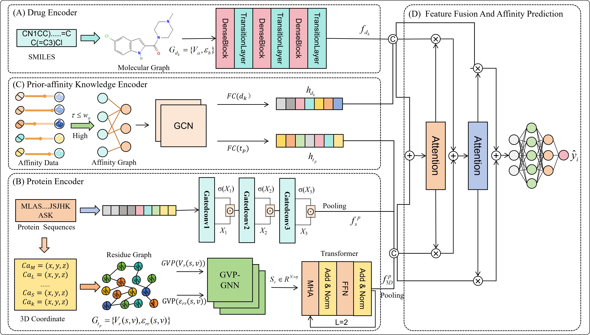

# PKR3dC: Drug-target Affinity Prediction by Introducing Prior-affinity Knowledge and Residue 3D Coordinate Information
    
This work presents PKR3dC, a deep learning approach for drug-target affinity (DTA) prediction that integrates residue 3D coordinate information from PDB files and known affinity values as prior knowledge, addressing the limitation of existing methods that underutilize protein 3D structural information. By using a multi-granularity feature fusion framework, it extracts fine-grained local features from drug molecular graphs, protein 3D structure graphs and sequences through DenseNet, GVP-GNN-transformer and gated CNN, obtains coarse-grained global features from drug-target topological affinity relationships via GCN, and adopts an attention-based module to fuse drug and protein features for better interaction modeling. Evaluated on Davis and KIBA datasets under four experimental settings, PKR3dC outperforms state-of-the-art models, particularly in cold-drug and cold-protein scenarios that simulate real experimental conditions.

## Architecture

## requirements
python==3.7.1 
torch==1.9.0+cu111 
torch-geometric==2.1.0 
torch-scatter==2.0.7 
torch-sparse==0.6.10 
torch-cluster==1.5.9 
torch-spline-conv==1.2.1 
networkx==2.6.3  
biopython==1.81 
rdkit==2023.3.2 
dgllife==0.3.2 
deeppurpose==0.1.5 
atom3d==0.2.4 
freesasa==2.2.1 
lifelines==0.27.8 
scikit-learn==1.0.2 
matplotlib==3.3.4 
pandas==1.1.5 
numpy==1.21.6 
tqdm==4.62.3 
plotly==5.18.0 
hyperopt==0.2.7

## Datasets download: It includes two public datasets, Davis and Kiba.
https://github.com/G-P-only/PKR3dC/data

## Running
### data processing
`python preprocessing.py`
`python preprocessing_aff.py`
### training(S1,S2,S3,S4)
`python train.py --dataset davis/feicold --save_model --batch_size 64 --lr 1e-4`
`python train_cold.py --dataset davis/(drug、protein、pair)--save_model --batch_size 64 --lr 1e-4 --drug_sim_k 4 --target_sim_k 7`
## visualization
`python visualization.py`
